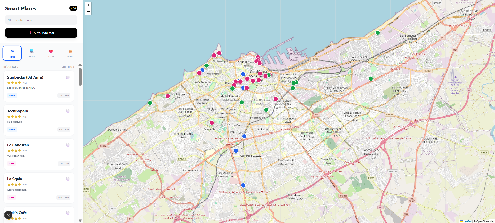

# 📍 Smart Places - Casablanca

Une application de cartographie interactive moderne pour découvrir les meilleurs lieux de Casablanca (Cafés, Restaurants, Espaces de travail).



## 🚀 À propos

**Smart Places** est un dashboard interactif qui aide les utilisateurs à trouver le lieu idéal selon leur "mood" (Travail, Date, Budget). L'application se distingue par l'utilisation de données réelles géolocalisées et une expérience utilisateur fluide sans rechargement de page.

L'objectif était de construire une alternative performante à Google Maps pour des recommandations locales, en utilisant uniquement des technologies Open Source.

## ✨ Fonctionnalités Clés

- **🗺️ Carte Interactive :** Navigation fluide avec Leaflet et OpenStreetMap (Zéro API payante).
- **📍 Géolocalisation HTML5 :** Détection automatique de la position de l'utilisateur.
- **📏 Calcul de Distance :** Algorithme (Haversine) pour afficher la distance réelle (km) vers chaque lieu.
- **🔍 Recherche Instantanée :** Filtrage en temps réel par nom ou description.
- **❤️ Système de Favoris :** Persistance des données via le LocalStorage du navigateur.
- **🏷️ Catégories Intelligentes :** Filtres dynamiques (Work, Date, Budget).
- **⏰ Statut Ouvert/Fermé :** Calcul automatique basé sur l'heure actuelle et les horaires du lieu.
- **📱 Responsive Design :** Interface adaptée (Layout Dashboard : Sidebar + Map).

## 🛠️ Stack Technique

Ce projet a été construit avec les dernières technologies du web moderne :

- **Framework :** [Next.js 15](https://nextjs.org/) (App Router)
- **Langage :** [TypeScript](https://www.typescriptlang.org/) (Typage strict pour la robustesse)
- **UI/Styling :** [Tailwind CSS](https://tailwindcss.com/) (Design moderne et rapide)
- **Cartographie :** [React-Leaflet](https://react-leaflet.js.org/) & OpenStreetMap
- **Icônes :** Leaflet DivIcon (CSS pur)

## 📂 Structure des Données

Contrairement aux démos classiques utilisant des données aléatoires, ce projet contient une base de données de **40 lieux réels à Casablanca**.

Les coordonnées GPS ont été vérifiées via un script de géocodage utilisant l'API Nominatim d'OpenStreetMap pour garantir la précision des marqueurs (Maârif, Corniche, Sidi Maârouf, etc.).

## 🚀 Installation et Démarrage

Pour lancer ce projet localement :

1.  **Cloner le dépôt :**
    ```bash
    git clone [https://github.com/whosredais/smart-places.git](https://github.com/whosredais/smart-places.git)
    cd smart-places
    ```

2.  **Installer les dépendances :**
    ```bash
    npm install
    ```

3.  **Lancer le serveur de développement :**
    ```bash
    npm run dev
    ```

4.  Ouvrez [http://localhost:3000](http://localhost:3000) dans votre navigateur.

## 🔮 Améliorations Futures

- [ ] Ajout d'un Backend (Node.js/Express) pour gérer les utilisateurs.
- [ ] Mode sombre (Dark Mode).
- [ ] Système de commentaires pour chaque lieu.
- [ ] Version mobile PWA (Progressive Web App).

## 👤 Auteur

**Ton Nom**
- LinkedIn : www.linkedin.com/in/mohamed-reda-boujir-a62087294

---
*Fait avec ❤️ à Casablanca.*

> **Note :** Les données géographiques ont été générées automatiquement via des scripts Node.js personnalisés (disponibles dans le dossier `/scripts`) qui interrogent l'API Nominatim d'OpenStreetMap.